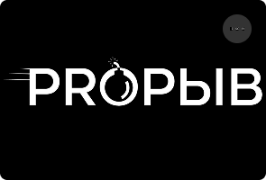

# 🚀 Qadam1 - Flutter Mobile App

<div align="center">
  
  
  **Professional Flutter application with clean architecture**
  
  [](https://flutter.dev/)
  [](https://dart.dev/)
  [](https://firebase.google.com/)
  [](LICENSE)
</div>

## 📱 О проекте

Qadam1 - это мобильное приложение для личностного развития и обучения, созданное с использованием Flutter. Приложение включает в себя курсы, видео-уроки от Рифа Ерлана, систему целей и прогресса.

### ✨ Основные функции

- 🎯 **Система целей** - постановка и отслеживание личных целей
- 📚 **Курсы** - интерактивные курсы с прогрессом
- 🎬 **Видео-уроки** - контент от Рифа Ерлана
- 📊 **Прогресс-трекинг** - отслеживание достижений
- 🔐 **Аутентификация** - безопасный вход через Firebase
- 📱 **Адаптивный дизайн** - поддержка всех устройств

## 🏗️ Архитектура

Проект построен с использованием **Clean Architecture** принципов:

```
lib/
├── core/                    # Основные компоненты
│   ├── constants/          # Константы приложения
│   ├── errors/            # Обработка ошибок
│   ├── firebase/          # Firebase конфигурация
│   ├── navigation/        # Навигация
│   ├── network/           # Сетевые запросы
│   └── utils/             # Утилиты
├── features/              # Функциональные модули
│   └── home/             # Главный экран
│       ├── data/         # Данные (API, модели)
│       ├── domain/       # Бизнес-логика
│       └── presentation/ # UI компоненты
└── shared/               # Общие компоненты
    ├── theme/           # Тема приложения
    ├── utils/           # Общие утилиты
    └── widgets/         # Переиспользуемые виджеты
```

## 🛠️ Технологии

- **Flutter** 3.3.0+ - UI фреймворк
- **Dart** - язык программирования
- **Firebase** - бэкенд сервисы
  - Authentication - аутентификация
  - Firestore - база данных
  - Storage - файловое хранилище
- **Riverpod** - управление состоянием
- **Go Router** - навигация
- **Google Fonts** - типографика
- **Video Player** - воспроизведение видео

## 📦 Установка

### Предварительные требования

- Flutter SDK (3.3.0 или выше)
- Dart SDK
- Android Studio / VS Code
- Git

### Шаги установки

1. **Клонируйте репозиторий:**
   ```bash
   git clone https://github.com/leylagxx/qadam1.git
   cd qadam1
   ```

2. **Установите зависимости:**
   ```bash
   flutter pub get
   ```

3. **Настройте Firebase:**
   - Создайте проект в [Firebase Console](https://console.firebase.google.com/)
   - Добавьте `google-services.json` в `android/app/`
   - Добавьте `GoogleService-Info.plist` в `ios/Runner/`

4. **Запустите приложение:**
   ```bash
   flutter run
   ```

## 🚀 Запуск

### Android
```bash
flutter run
```

### iOS
```bash
flutter run -d ios
```

### Web
```bash
flutter run -d web
```

## 📱 Скриншоты

<div align="center">
  
  
  
</div>

## 🎯 Основные экраны

- **Главный экран** - дашборд с целями и курсами
- **Курс "ПРОРЫВ ДЕНЬГИ"** - интерактивная карточка курса
- **Видео-уроки** - контент от Рифа Ерлана
- **Профиль** - настройки пользователя
- **Цели** - управление личными целями

## 🔧 Разработка

### Структура проекта

- `lib/features/home/` - главный экран приложения
- `lib/shared/` - общие компоненты и темы
- `lib/core/` - основные утилиты и конфигурация

### Добавление новых функций

1. Создайте новую папку в `lib/features/`
2. Следуйте структуре Clean Architecture
3. Добавьте тесты в `test/`

### Команды для разработки

```bash
# Анализ кода
flutter analyze

# Форматирование кода
dart format .

# Запуск тестов
flutter test

# Сборка APK
flutter build apk

# Сборка для iOS
flutter build ios
```

## 📄 Лицензия

Этот проект лицензирован под MIT License - см. файл [LICENSE](LICENSE) для деталей.

## 👥 Авторы

- **Leyla** - *Основная разработка* - [@leylagxx](https://github.com/leylagxx)

## 🙏 Благодарности

- Команде Flutter за отличный фреймворк
- Firebase за мощные бэкенд сервисы
- Сообществу разработчиков за вдохновение

## 📞 Поддержка

Если у вас есть вопросы или предложения, создайте [Issue](https://github.com/leylagxx/qadam1/issues) в репозитории.

---

<div align="center">
  <p>Сделано с ❤️ с помощью Flutter</p>
  <p>⭐ Поставьте звезду, если проект вам понравился!</p>
</div>